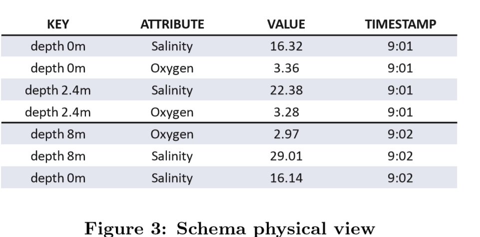
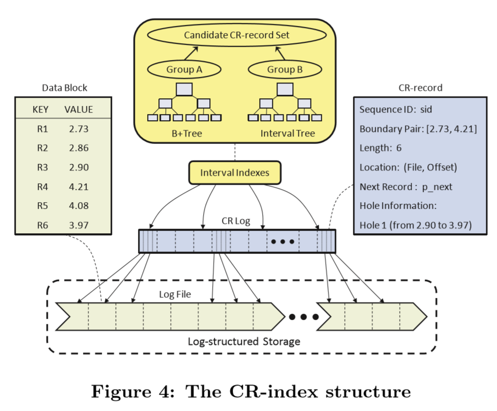

# 1.摘要

​	现在大量的数据连续不断地自传感器采集而到达数据库，这种数据称为observational data，一个大问题就是如何处理密集型的写，log-store（日志结构的存储）有能力处理高写通量，成为首选。

​	本文的贡献就是发明了CR-index（连续范围索引），能在不影响log-store处理写能力的情况下得到一个轻量且快速的索引结构，轻量到甚至可以加载到RAM里，如果不行再加一层索引。

# 2.简介

## 2.1 log-store的写处理机制

​	log-store能够高效处理密集性写需求主要是因为它把传输来的数据附加到日志文件尾中（append），而并非每条记录都要查找特定位置然后添加 (insert) ，这样就减少了大量的磁盘随机IO。

## 2.2 observational data的一些特性

- 不会更新(原始真实数据不会产生更新)
- 持续性变化（传感器监测的物理变量**<u>一般</u>**都会在某个最大速率之内持续变化）
- 可能存在gap（各种各样的原因会导致变量并非总是连续的，会有一些凸起和凹陷）
- 空间上有联系（比如同一个位置的温度等物理特征相近，至少变化趋势应该相同）

## 2.3 现有的技术局限

- 传统的记录层面索引，B+树索引，LSM树索引，维护成本太高
- 比如大量的随机写，导致调整B+树的结构不太现实
- 比如LSM树，会维护大量的索引项

## 2.4 log-store存储observational data的查询优势

- 对于时间范围的查询，按时间顺序排列，查询有天然优势
- 对于那些属性范围的查询，由于有数据的连续性，所以这些属性的值和观测时间也有一定联系

## 2.5 CR-index简介

​	基于修剪的索引结构，是一种轻量级的新型索引，用于范围查询，针对log-store进行特定的修改，满足了很多这种时间序列特性。

​	基本策略是把连续的记录分块，每个块都总结成一个值的范围，这个范围很小并且快速计算。对于块内部的无可避免的gap，他可以在查询处理的过程中逐渐学习适应。
总结来说，虽然轻量级，但是精度会下降，不过会在查询的过程中逐渐优化。

​	这个索引结构经过测评之后很厉害，写新数据时开销不大，查询效率也有提升

# 3.准备

## 3.1 科学数据分析手段

- 连续变量的性质：中值定理
  - 如果在连续的一块连续测量数据中找到最小值与最大值，那么这个范围中间的任何一个值应该都可以找到
- 连续测量的性质：默认在一个最大速度之内变化
  - 如果有两次测量值，知道每次测量最大跨度是多少，可以估算出最少能测到的数据
- 实际应用的查询主要是两种，时间范围查询，属性范围查询，以及相结合
- 会在很多属性上建立辅助索引

## 3.2 log-store

log-store分两种，有序的，无序的

### 3.2.1 有序log-store

​	记录先写到内存的缓冲区，排序，然后分批进入磁盘

### 3.2.2 无序log-store(本文选择LogBase存储系统)

- 不排序的log-store写是直接append到磁盘上，但是读的效率必然受到影响。但是在这种observational data里，还是可以让它有优秀的表现
- 数据模型基本上是关系型，主键加属性这种形式
- 在物理上，每个到达数据库的记录按照各个属性被分解为一系列的Cell，每个cell的格式是**<u>（记录的主键，属性，属性值，时间戳）</u>**
- LogBase把属性分组，这个分组是可选的，不在一个组的属性在不同的log file里，甚至不在一个机器上

### 3.2.3 数据存储的逻辑视图


### 3.2.4 数据存储的物理视图

- 每个cell的时间戳分为两部分，一个物理时间记录系统时间用于备份恢复，另一个逻辑时间记录传感器端的观测时间。

- 对于同一台传感器，物理时间对逻辑时间有保序性。先观测到的，一定先到达数据库。

- 不同传感器不一定遵守保序性，不过可以粗略认为。



### 3.2.5 observational data的数据局部性

​	虽然说这种append写策略本身不具备数据局部性，但是对observational data的访问会产生一些数据（空间）局部性。

- 目前的查询很多都是时间范围查询，而我们又是按时间append上去的，所以搜索一次磁盘，接下来顺序扫描就可以得到结果集，
- 查询经常是属性值范围的查询，前文提到过数据的连续性，这也就意味着值近似的可能成块出现，形成了部分的数据局部性

# 4.索引

## 4.1 CR-index基本实现

​	针对于某一属性来说，在其上建立CR-index，先把数据分块，将多个块合并，并总结一些描述信息加上地址信息，构成一个CR-record，所有的CR-record形成CR-LOG



### 4.1.1 数据块大小的选择

​	数据块size越大，总的数据块数越少，磁盘搜索次数越少，磁盘内部遍历cost越大

### 4.1.2 CR-record如何描述Data Blocks

- 用连续性假设来估算一个data block的上下边界，看查询的范围和边界有没有交集，有交集的遍历，没交集的舍弃
- 当数据不严格连续或者查询范围过小会有误差
- CR-record具体属性如下

| 属性             | 描述                                                    |
| ---------------- | ------------------------------------------------------- |
| BlockID          | 数据块序号                                              |
| Boundary Pair    | 被索引属性的上下界                                      |
| Block Length     | block中有多少record                                     |
| File Position    | block位置的文件偏移量                                   |
| Hole Information | 有关hole的信息，一个size为k的列表，长、宽等信息，后文说 |

### 4.1.3 对Data Blocks的索引实现

​	每个Boundary Pair可以被描述成一个区间，所以一个范围查询，实际上是一个在CR LOG里面的一个交集查询的问题，如果CR LOG在内存里，遍历搜索问题也不大，但是如果CR LOG比较大，在磁盘上，那么在其上再建立一层索引，就变得必要了。这一层索引包含较少信息（可能只包含重要的Boundary Pair信息），因而更加轻量。

​	传统的区间树和段树结构太依赖于查询范围，范围越大，遍历越广，影响效率。

​	<u>**重点来了，本文提供了一种新的建立索引的思想**</u>：

​	对于CR-LOG，针对同一个属性（Boudary Pair，或者说是区间）建立两棵树作为索引。

- 第一棵树：B+树(point tree)

  对于每个CR-record，B+树上插入两个entry，分别代表两个区间端点，所以B+树上entry的数量是CR-record的两倍。

  查询的时候从左到右去查询，每个端点都包含指向CR-Record的指针信息。

  说到这里，可以看出，这一棵树在查询中负责的CR-record是至少有一个端点在查询范围内的，那么CR-Record区间包含查询范围的呢？

- 第二棵树：区间树

  刚刚提到，范围交集问题对于区间树来说效率并不高，但是注意，这里这棵树的作用只针对一种特殊情况：找到一些CR-Record区间完全包含查询范围
  
  那就可以有这样一种想法，**<u>化线为点</u>**，把查询范围简化成查询范围中的任何一点。之后我们在这颗区间树中不做交集运算，只做命中查询，而命中查询对于区间树来说是强项，只遍历一条路径就可以完成任务，因此非常高效。
  
  但是化线为点也会带来一个问题，可能在第二棵树找到的某些CR-record在找第一棵树的时候已经找到过了（非常易证存在这种情况），即两棵树找到的CR-Record有重叠，解决这个也简单，取并集去重即可

## 4.2 索引优化

实现了基本的CR-index之后，仍然有两个必须解决的问题

- 如何让区间索引（两棵树）足够轻量来缓存？
- 一旦出现数据的不连续如何适应？

### 4.2.1 差量区间索引

因为数据存在着连续性，在这个区间上找到了，下一个区间也有很大可能是result，因此考虑不在索引树中存完整的区间长度，而是只存一个差量

#### 4.2.1.1 B+树差量区间索引

不再把每个CR-record两个端点都插入到树里，而是相对于上一个CR-record，如果某个端点在上一个CR-record端点范围内，就不再添加到B+树里

#### 4.2.1.2 区间树差量区间索引

插入到区间树的区间变小了，甚至被前一个区间所包含的区间干脆不insert到区间树里

**<u>这里原文中有一句话没有读懂</u>**：

------

For the interval tree, the lengths of inserted intervals are reduced. S<u>maller intervals will be pushed closer to the leaf nodes, thereby reducing the size of upper-level nodes cached in memory.  Although in case (d) two intervals are inserted, the total length becomes smaller</u>

为什么说小区间插入到区间树上就会贴近叶子节点，贴近叶子结点为什么可以减少内存中缓存的高层节点，缓存到内存的只有高层节点么，B+树和区间树不可以整个放进内存里么？

------

进一步，我们未必要用前面的一个，如果前面k个CR-record已经覆盖一定范围，那么只把范围之外的放进树里即可，而不必非要是前一个

==算法1：如何对优化过的索引树（B+,区间）进行查询==

------

```C
Set result;
for each entry e in tree:
	int counter=0;
	Record current=seek(e.position);
	while(counter<k):
		++counter;
		current=current.next();
		if current overlaps range:
			result.add(result);
			counter=0;
return result;
```

对这个算法有一些==疑点1==：

1. 第8行的判断条件：可以保证无疏漏，但是会导致重复判断与磁盘搜索，因为下一个overlap的CR-record也有可能只是部分的重合前一个，它在B+树上也有entry，在B+树上遍历时也会遍历到，再次进行磁盘搜索，这就会导致重复。尤其是当K=k时，这种重复将更加明显。
2. 优化的区间树索引结构，还没有完全弄清楚

------

### 4.2.2 Hole Skipper

Hole Skipper是为了处理数据的不连续性而出现的。

之前我们认为闭区间上连续函数的中值定理，极大极小值之间的任意值都存在，但是由于gap的存在，可能一个子范围内是没有值的，导致错误的fetch

hole是说范围内的一个子范围不存在这样的值，这样的hole在邻近的data block有相似的特征，所以定义hole的长度，即这样类似的hole可以在邻近几个block之间都有。
而且hole的长度越长，hole就会越窄，即空缺的范围越小

如果查询范围落入hole里，直接跳过这个长度的各个block

HS 就是这样一种机制，它存在于每个CR record里，每个CR record 只保留前几名大的hole。它有自适应的过程，查询过程中如果被索引到，但是在实际的data block里并没有找到query range里的数据，就会开始添加Hole，下次跳坑。但是，系统只维护曾经查询过的洞，用户不感兴趣的洞，系统不知道也不维护。

==算法2：detectHole(List CRrecords, Range range)==

------

```C
Hole currentHole;
dataBlock currentBlock;
for each record r in CRrecords:
	currentBlock=seek(r.position);
	if no results inside range:
		if r not next to currentHole:
			currentHole=new Hole();
			currentHole.add(currentBlock);
		else:
			currentHole.extendLength();
	else:
		r.addHole(currentHole);
		currentHole.clear();	
```

------


## 4.3 对乱序数据的处理

各种原因会导致某些数据先被探测到，却后到达数据库。

- CR索引只关注一个data block的值范围，对于内部顺序不太Care

为了解决这个乱序而来的数据，给出这样一个checkpoint list机制，定期加一个时间点，附带两个信息：
1. 比这个时间点晚的最小的block id（就是最先到达系统的）
2. 比这个时间点早的最大的block id（就是最晚到达系统的）
看有没有交叠，就可以判断出乱序问题，这个list在内存中，更新比较方便。
在时间范围查询的时候，这个list也比较准确

## 4.4 查询步骤总结

1. 将查询范围分别对两棵树进行索引，分别得到一组结果，将两组结果合并，去重，得到CR-record结果集
2. 根据结果集，定位到磁盘中的CR-record，找出CR-Records结果集
3. 用checkpoint-list和hole-information对结果集进行筛选，形成最终结果集
4. 在DataBlocks里扫描并返回结果
5. 对于那些找不到所需数据的Block，更新hole的信息

## 4.5 索引表现分析

考虑一个按时间顺序排布的记录集D，N<sub>D</sub>条记录，查询范围[a,b]，结果集R

### 4.5.1 数据的连续性衡量

- 定义：连续性距离，非形式化地来讲，就把相邻两个值的差的绝对值代数相加，然后取平均，意义就是平均距离
  $$
  dis(D)=\frac{1}{N_D-1}\Sigma_{i=2}^{N_D}dis_i\\
  dis_i=|v_i-v_{i-1}|
  $$

- 定义：连续度，dis(D)是一个绝对值，单独拿出来没有意义，需要考虑查询范围的情况，连续度定义为查询范围的大小除以连续性距离
  $$
  doc(Q,D)=\frac{|b-a|}{dis(D)}
  $$
  

### 4.5.2 查询代价

因为假设的数据连续性，所以查询到的结果必然是若干个连续的记录序列

对于R中任意一个记录，假设其属性值为x，那么从进入到该记录，再到离开，记录为一条路径，最短路径长度就是进出点都是最近点
$$
path(x)=2*min(|x-a|,|x-b|)
$$

$$
path=\int_a^bpath(x)/(|b-a|)dx=\frac{|b-a|}{2}
$$

path是路径长度的**<u>期望</u>**，那么path/dis(D)为x所在序列记录数的期望，其恰好等于doc(Q,D)/2，那么序列数N<sub>seq</sub>可以计算为
$$
N_{seq}=\lceil \frac{2|R|}{doc(Q,D)}\rceil
$$
设每个Data Block都包含L<sub>block</sub>条记录，那么每个序列至多需要（6）BlockSs
$$
\lceil \frac{doc(Q,D)}{2L_{block}}+1 \rceil
$$
以此可以推算出访问的最多记录数B，
$$
B<=N_{seq}*\lceil \frac{doc(Q,D)}{2L_{block}}+1 \rceil*L_{block}
$$
以及消耗代价
$$
COST=T_{seek}*N_{seq}+T_{trans}*B
$$
==疑问2==：文中认为这是至多消耗的代价，我认为这里是平均代价，因为路径长度，序列数都是期望值，后续不可能是最大值

### 4.5.3 存储代价 VS 查询表现

主要权衡这两个事情的是一个重要的变量：就是Data Block的大小,block越大，CR-Log Size越小,block每增加△L，访问到的记录数仅仅增加N<sub>seq</sub>△L个，这对于查询时间来说影响不大，但是可以让CR-Log Size有效减少

## 4.6 多属性查询

### 4.6.1 多个连续属性

想法也很简单，对于每个属性跑一遍CR-index，把CR-record找到之后，根据逻辑关系进行融合，再去Fetch Data Block

实现这个想法有一个必要的结构基础，那就是所有属性的索引必须基于一个全局的数据块划分，在所有索引眼里，block id都是统一的，这样才能进行融合，避免fetch 多余的data block.

### 4.6.2 主键属性参与到多属性查询中

一个问题就是其它属性可能有CR-index，主键的主索引可能是只有checkpoint list这种直接对接到record的索引，于是产生两种选择：

1. 先用主索引把符合主键限制的fetch出来，再根据其它属性的查询范围进行筛选
2. 先用CR-index把符合非主键属性查询范围的data block fetch出来，再根据主键限制进行筛选

当符合条件的data block不多的时候，我们优先选择第二种选择，以避免大面积磁盘搜索。

这里有一句话没理解:

==疑问3：文中所说distinct keys, boundary-pair分别指的是什么==

------

There is a second type of multi-attribute query, which includes a constraint on primary-key attributes, e.g., the retrieval of data from a specific sensor for a time period besides a range of salinity. **<u>If the number of distinct keys that will be retrieved is limited, an additional boundary-pair can be added for each such key</u>** They further filter CR-records before fetching blocks. I**<u>n the worst case where there are an excessive number of distinct keys, we still have two choices in execution:</u>**

------


# 5. 实验结果

用了两个实际数据源，对这个CR-index进行评测，结果都不错。